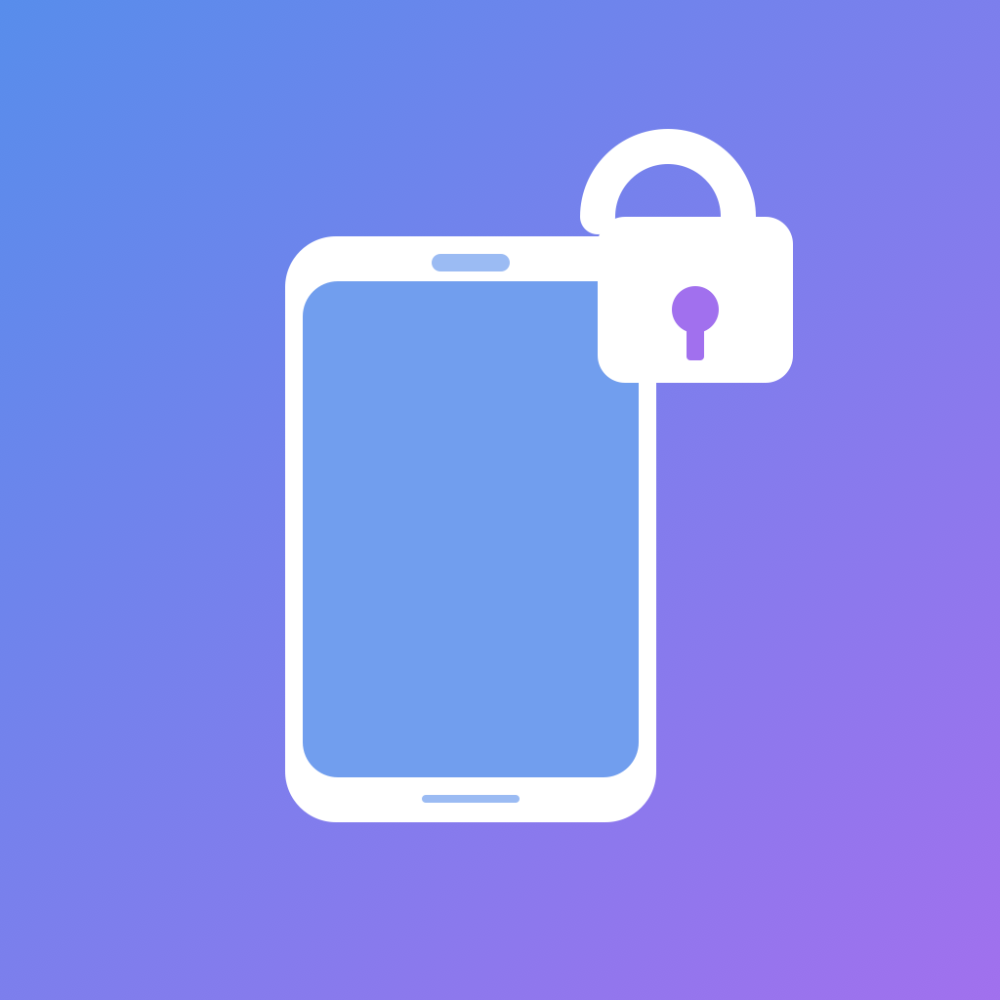

<div align="center">
  
  <h1>ProximityUnlock</h1>
  <p><strong>Lock your Mac when you walk away. Unlock it when you come back.</strong></p>
  <p>
    
    <a href="https://github.com/raghix123/ProximityUnlockMac/releases/latest"></a>
    <a href="LICENSE"></a>
  </p>
</div>

A macOS menu-bar app that uses Bluetooth Low Energy to sense your paired iPhone and lock or unlock your Mac automatically — no typing, no tapping, no cloud.

## Features

- **Hands-free lock and unlock** — cross your "far" threshold, Mac locks; cross "near," it wakes and types your password.
- **100% on-device** — BLE only. No iOS app, no account, no network calls, no telemetry by default.
- **Tunable sensitivity** — separate near/far thresholds with a deliberate dead zone so you don't get flicker at the edge.
- **Auto-updates** via Sparkle with EdDSA signatures.
- **Menu bar only** — no dock icon, no Login Items clutter.

## How it works

Your iPhone broadcasts a BLE advertisement that's unique and stable once paired over classic Bluetooth. ProximityUnlock listens for that advertisement, reads its RSSI (signal strength), and smooths the stream to decide near vs. far. Crossing the far threshold runs Apple's private lock API; crossing the near threshold wakes the display and types your saved login password via the Accessibility API.

## Requirements

- macOS 26.2 or later
- A Mac with Bluetooth Low Energy
- An iPhone paired with this Mac at least once (classic Bluetooth pairing — so the iPhone is a known device)
- Accessibility permission (for typing the password at the login window)

## Install

1. Download the latest `ProximityUnlock-<version>.dmg` from the [Releases page](https://github.com/raghix123/ProximityUnlockMac/releases).
2. Open the DMG and drag **ProximityUnlock** into the Applications folder.
3. Launch it. Onboarding walks you through device selection, Accessibility permission, and saving your login password.

Prefer a `.zip`? It's on the same release page and contains the same app.

### First-launch warning (pre-notarization builds)

Until the app is notarized by Apple, macOS Gatekeeper may block the first launch with a "cannot be opened" or "can't be verified" dialog. Here's how to get past it — no terminal required:

1. Click **Done** or **OK** on the warning dialog.
2. Open **System Settings → Privacy & Security**.
3. Scroll down. You'll see "ProximityUnlock was blocked…" with an **Open Anyway** button next to it. Click it.
4. Confirm with Touch ID or your password.

You only need to do this once. Sparkle updates won't re-trigger the warning.

## Build from source

```bash
git clone https://github.com/raghix123/ProximityUnlockMac
cd ProximityUnlockMac
xcodebuild -scheme ProximityUnlockMac -destination 'platform=macOS' build
```

Or open `ProximityUnlockMac.xcodeproj` in Xcode to run and debug.

## Permissions & privacy

- **Bluetooth** — macOS prompts on first launch. Used only to scan for advertisements; the app never connects to your iPhone.
- **Accessibility** — granted manually in System Settings → Privacy & Security → Accessibility. Required so the app can type your password at the login window.
- **Keychain** — your Mac login password is stored in the login keychain with `kSecAttrAccessibleWhenUnlockedThisDeviceOnly`. Never leaves the device.
- **No PII in analytics** — the opt-in TelemetryDeck signals only report bucketed threshold values and event counts. No device names, no passwords, no identifiers. Toggle off under Settings → General → Telemetry.

## Troubleshooting

**My iPhone doesn't appear in the device picker.** Open Control Center → Bluetooth on the iPhone so it's advertising, then pair it with the Mac once in System Settings → Bluetooth. After that it shows up in the picker.

**It detects my iPhone but never unlocks.** Make sure Accessibility is granted in System Settings → Privacy & Security → Accessibility, and that your login password is saved in Settings → Security.

**Unlock/lock triggers too eagerly or too reluctantly.** Adjust sliders in Settings → Sensitivity. `-65 dBm` is typical for "at your desk"; `-85 dBm` is typical for "one room away." The dead zone between the two thresholds is deliberate — it prevents flicker.

**Mac locked while I was still at my desk.** RSSI is noisy; drop the far threshold a few dBm until it matches your room layout.

## Credits

- Icon by [Freepik on Flaticon](https://www.flaticon.com)
- [Sparkle](https://sparkle-project.org) for updates
- [TelemetryDeck](https://telemetrydeck.com) for opt-in anonymous analytics

## License

MIT. See [LICENSE](LICENSE).
